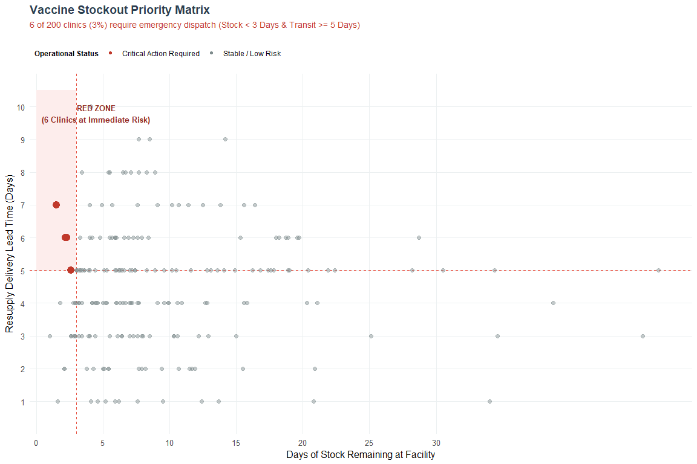

### Overview

This solution redesigns the cluttered dashboard into an **action-oriented exception report** using only **`ggplot2`** and **`dplyr`**.

Instead of forcing users to filter through 200 map pins, this plot places every clinic on two operational axes:

* **X-Axis**: **Days of Stock Left** (how long until the clinic runs out).

* **Y-Axis**: **Delivery Lead Time (Days)** (how long it takes for a resupply shipment to arrive).

#### Key Design Steps

1. **Data Transformation (`dplyr`)**: We extend our synthetic dataset to calculate operational days of stock and resupply lead time, creating a binary flag (`is_red_zone`) where stock remaining is less than or equal to transit time (specifically focusing on clinics with $<3$ days of stock and $\ge 5$ days lead time).

2. **Visual Risk Shading (`geom_rect`)**: Add a shaded background zone directly onto the plot canvas highlighting the critical threshold area.

3. **High-Contrast Encoding (`geom_point`)**: Use a two-tone palette—critical clinics pop in bold alert red (`#E74C3C`), while secure clinics recede into muted slate grey (`#BDC3C7`).

4. **Reference Thresholds (`geom_vline` / `geom_hline`)**: Draw dashed reference lines indicating the critical 3-day stock mark and 5-day transit mark.

5. **Direct Annotation & Context**: Remove legend clutter and use clear titles and text annotations directly on the plot.

### Complete R codes  

#### 1. Load Required Libraries


``` r
library(dplyr)
library(ggplot2)
# Ensure reproducibility
set.seed(42)
```

#### 2. Build Dataset (Extending previous 200 Clinic sample)


``` r
n_clinics <- 200
clean_data <- tibble(
  clinic_id    = paste0("Clinic-", sprintf("%03d", 1:n_clinics)),
  region       = sample(paste("Region", LETTERS[1:4]), n_clinics, replace = TRUE),
  vaccine_type = sample(c("HepB", "BCG", "OPV", "Measles"), n_clinics, replace = TRUE),
  # Realistic operational metrics
  days_of_stock = round(rlnorm(n_clinics, meanlog = 2.0, sdlog = 0.75), 1),
  lead_time_days = sample(1:10, n_clinics, replace = TRUE, prob = c(5, 10, 15, 20, 20, 15, 8, 4, 2, 1))
) %>%
  # Flag the Red Zone: Critical stock (<3 days) paired with high transit delay (>=5 days)
  mutate(
    is_red_zone = if_else(days_of_stock < 3 & lead_time_days >= 5, "Critical Action Required", "Stable / Low Risk"),
    is_red_zone = factor(is_red_zone, levels = c("Critical Action Required", "Stable / Low Risk"))
  )
# Calculate summary metrics for subtitle display
critical_count <- sum(clean_data$is_red_zone == "Critical Action Required")
stockout_risk_pct <- round((critical_count / n_clinics) * 100, 1)
```

#### 3. Build High-Contrast Action-Priority Scatter Plot  


``` r
p_priority <- ggplot(clean_data, aes(x = days_of_stock, y = lead_time_days)) +
  # A. Shaded "Red Zone" background boundary
  geom_rect(
    xmin = 0, xmax = 3,
    ymin = 5, ymax = 10.5,
    fill = "#FDEDEC",
    color = NA,
    alpha = 0.8
  ) +
  # B. Reference Threshold Lines
  geom_vline(xintercept = 3, linetype = "dashed", color = "#E74C3C", linewidth = 0.7) +
  geom_hline(yintercept = 5, linetype = "dashed", color = "#E74C3C", linewidth = 0.7) +
  # C. Scatter Points with High Visual Contrast
  geom_point(
    aes(color = is_red_zone, size = is_red_zone, alpha = is_red_zone)
  ) +
  # D. Direct Point Scale Settings
  scale_color_manual(
    values = c("Critical Action Required" = "#C0392B", "Stable / Low Risk" = "#7F8C8D")
  ) +
  scale_size_manual(
    values = c("Critical Action Required" = 3.8, "Stable / Low Risk" = 2.0)
  ) +
  scale_alpha_manual(
    values = c("Critical Action Required" = 1.0, "Stable / Low Risk" = 0.45)
  ) +
  # E. Annotate the Danger Quadrant Directly
  annotate(
    "text",
    x = 4.5, y = 9.8,
    label = paste0("RED ZONE\n(", critical_count, " Clinics at Immediate Risk)"),
    color = "#922B21",
    fontface = "bold",
    size = 3.5,
    hjust = 0.5
  ) +
  # F. Axis & Scale Configuration
  scale_x_continuous(
    breaks = seq(0, 30, by = 5),
    limits = c(0, max(clean_data$days_of_stock) + 2),
    expand = c(0, 0.5)
  ) +
  scale_y_continuous(
    breaks = seq(1, 10, by = 1),
    limits = c(0.5, 10.5)
  ) +
  # G. Clear, Insight-Led Typography
  labs(
    title = "Vaccine Stockout Priority Matrix",
    subtitle = paste0(
      critical_count, " of ", n_clinics, " clinics (", stockout_risk_pct,
      "%) require emergency dispatch (Stock < 3 Days & Transit >= 5 Days)"
    ),
    x = "Days of Stock Remaining at Facility",
    y = "Resupply Delivery Lead Time (Days)",
    color = "Operational Status"
  ) +
  # H. Clean Theme
  theme_minimal(base_size = 12) +
  theme(
    plot.title = element_text(face = "bold", size = 14, color = "#2C3E50"),
    plot.subtitle = element_text(size = 10.5, color = "#C0392B", margin = margin(b = 14)),
    panel.grid.minor = element_blank(),
    panel.grid.major = element_line(color = "#ECF0F1"),
    legend.position = "top",
    legend.justification = "left",
    legend.title = element_text(face = "bold", size = 9),
    legend.text = element_text(size = 9)
  ) +
  guides(
    size = "none",
    alpha = "none"
  )
# Display the final visualization
print(p_priority)
```

<!-- -->

